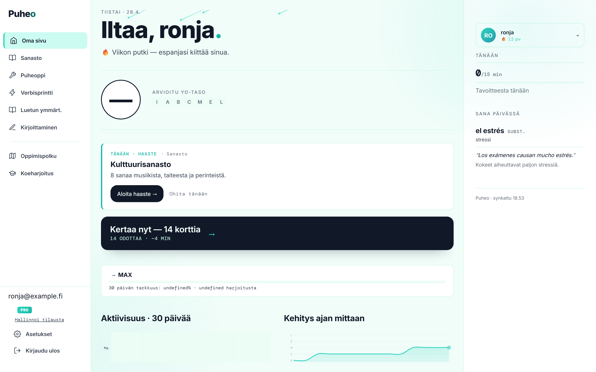

# Puheo Landing Page Rebuild — Plan

**Status:** READY TO BUILD. Agent: read this in full, write a per-loop breakdown into PLAN.md, then start with Section A (Setup).

## Strategic frame

- **Audience:** Finnish high-school students (lukiolaiset) preparing for the Spanish YO-koe (lyhyt oppimäärä). NOT parents, NOT teachers. Speak to them directly. "Sinä." Not "lapsenne."
- **Single goal:** signup to free account. Every CTA points to `/register` (or whatever the existing free-signup route is — find it in `routes/auth.js` and reuse). Pro upsell happens later inside the dashboard, NOT on landing.
- **Visual direction:** restrained premium, à la Linear / Vercel / Stripe. Dark or near-dark base, subtle gradients, generous whitespace, calm type, motion is purposeful not decorative. The opposite of cluttered Duolingo / Babbel chaos. We're selling seriousness — this is exam prep, not a game.
- **No social proof yet:** user has no real numbers. Build the structure with clearly marked `<!-- TODO: replace with real number -->` placeholders. Do NOT invent fake numbers. Do NOT write "Yli 6 681 000 opiskelijaa" like Astra did — that's how trust dies.
- **No mobile-app mockups.** Puheo is a web app. Browser frames and isolated UI fragments only.

## Section A — Setup (Loop 1 of landing rebuild)

Before writing any landing markup:

1. **Read the existing landing.** `index.html` and any `index.css` / `landing.css`. Note: hero copy, current sections, current CTAs, current routes referenced. Don't blow it up — refactor section-by-section so registration flow keeps working through the rebuild.

2. **Read the references.** Do all of these with WebFetch + Playwright:
   - `references/astra/` — competitor (already in repo). Use for layout instinct only — Astra is colorful/loud, we're going restrained.
   - linear.app — primary aesthetic reference. Note: gradient hero, typography scale, isolated UI cards floating in hero, section rhythm, footer.
   - vercel.com — secondary reference. Note: how they show product without phone mockups (browser frames, code blocks, isolated cards).
   - stripe.com — tertiary. Note: typography, density, color discipline.
   - cron.com (now cal.com/cron) — restraint and motion reference.
   - duolingo.com (loud counter-example — we are NOT this).
   Save 1-2 screenshots of each into `references/landing/<site>/` for future loops.

3. **Lock the design tokens.** Create or extend `css/landing-tokens.css` with the landing-specific palette and type scale. These tokens are SEPARATE from the app tokens — landing has its own visual identity.
   - Background: deep near-black with subtle gradient. `--bg: #0a0a0a;` `--bg-elevated: #141414;` `--bg-gradient: radial-gradient(ellipse at top, #1a1a2e 0%, #0a0a0a 60%);`
   - Surface: `--surface: rgba(255,255,255,0.04);` with `border: 1px solid rgba(255,255,255,0.08);`
   - Text: `--text: #fafafa;` `--text-muted: #a1a1aa;` `--text-subtle: #71717a;`
   - Accent: pick ONE accent that matches Puheo's existing app accent (probably the teal from screenshots — `--accent: #14b8a6` or whatever Puheo uses). Use sparingly: CTAs, the "good" indicator on stat cards, link underlines on hover.
   - Type: display font + body font. Use Geist (free, modern, restrained) for both — `Geist` for display via Google Fonts variant, `Geist Sans` for body. Or `Inter` if Geist isn't available. Whatever pairing, it must render Finnish ä/ö correctly.
   - Type scale: 14, 16, 18, 24, 32, 48, 72, 96. Display sizes use tight tracking (`letter-spacing: -0.03em`). Body uses normal.
   - Spacing: 8px base, scale 8/16/24/32/48/64/96/128.
   - Radius: 8 / 12 / 16 / 24. Borders are thin, 1px, low-opacity white over dark.
   - Motion: 150-300ms transitions on interactive elements, ease-out. No bouncing, no spinning. One subtle scroll-reveal per section max.

4. **Install asset libraries.** All vanilla, all free:
   - `lottie-web` (npm) — for ONE animated icon at the hero, if it earns its place. Otherwise skip Lottie entirely.
   - `iconify-icon` (npm) OR Lucide Icons inline SVG — for icons throughout.
   - Geist or Inter via `<link>` to Google Fonts (preconnect first).
   - DO NOT install GSAP unless one specific section truly needs it — CSS transitions handle 95% of this aesthetic.

5. **Capture real Puheo screenshots** for use in browser-frame mockups later. Run Playwright against the dev server, log in as test account, screenshot:
   - Dashboard (1440×900 + 375×812 dark theme)
   - One vocab exercise mid-flight
   - Writing task with AI feedback annotations
   - Profile (the new one-page version)
   Save to `references/puheo-screens/`. These get embedded in browser-frame mockups in Section D.

## Section B — Page structure (Loop 2)

The landing is ONE long page with these sections in order. Each is a horizontal full-width strip with vertical padding `96px` desktop / `64px` mobile. Max content width `1200px`, centered.

```
1. NAV BAR              (sticky, transparent → solid on scroll)
2. HERO                 (above the fold)
3. PROBLEM              (one sentence + supporting line)
4. PRODUCT — 3 PILLARS  (vocab / grammar / writing — three cards with screenshots)
5. HOW IT WORKS         (3 steps, numbered, restrained)
6. AI GRADING SHOWCASE  (the unique angle — show the writing grader in action)
7. PRICING              (free vs Pro side-by-side, no decoration)
8. FAQ                  (5-7 collapsible items)
9. FINAL CTA            (one big card, single button)
10. FOOTER              (minimal — links + copyright)
```

Build this as ONE `index.html` with semantic `<section>` tags. Each section is independently styleable. No SPA routing — landing is a static document.

## Section C — Section-by-section spec

### 1. NAV BAR

- Height 64px. Sticky. Background starts transparent, becomes `rgba(10,10,10,0.8)` with `backdrop-filter: blur(12px)` + thin bottom border on scroll.
- Left: Puheo wordmark (text only, current font, slight weight increase).
- Center: links — "Tuote" / "Hinnoittelu" / "FAQ" — anchor scrolls.
- Right: "Kirjaudu" (ghost button) + "Aloita ilmaiseksi" (filled accent button, the primary CTA, repeated 5-6 times across the page).
- Mobile: collapse links into a hamburger that opens a full-screen overlay menu.
- **Source pattern:** Linear's nav. Implement as plain HTML/CSS, no React.

### 2. HERO (most important — get this right)

Layout: two-column on desktop (60/40), single column stacked on mobile. Left column: copy. Right column: visual.

**Left (copy):**
- Tiny eyebrow label: `ESPANJAN YO-KOE • LYHYT OPPIMÄÄRÄ` (uppercase, tracking +0.1em, color `--text-subtle`, 12px).
- Massive H1, 72px desktop / 40px mobile, weight 600, tracking -0.04em: **"Pärjää espanjan YO-kokeessa. Ilman kalliita kursseja."** (one line if possible, max two)
- Sub-headline, 20px, `--text-muted`, max-width 540px: "Puheo on tekoälyvalmentaja, joka tuntee YO-rubriikin. Kymmenen minuuttia päivässä — ja kirjoituksesi, sanastosi ja kielioppisi tuntuvat eri tasolta kokeessa."
- Two buttons in a row:
  - Primary: "Aloita ilmaiseksi →" (filled, accent, no card needed before signup)
  - Ghost: "Katso miten se toimii" (smooth-scrolls to "How it works" section)
- Below buttons, tiny 14px row: "Ei luottokorttia • Suomen kielellä • Toimii selaimessa"

**Right (visual):**
- The Puheo dashboard or writing-task screenshot inside a **browser frame component** (see Section D). Slight rotation (-3deg), drop shadow `0 40px 80px -20px rgba(20,184,166,0.2)` to give it a faint accent glow.
- One floating standalone UI card behind it, slightly off-axis — a single Puheo "correct answer" card or a streak chip. This is the Linear move: real product fragments instead of cartoony illustrations.
- Subtle radial gradient blob behind everything as glow.

**Background:** the `--bg-gradient` radial top.

**No Lottie here.** No phone frames. No characters from unDraw. Just product, real, presented confidently.

### 3. PROBLEM

One section, two-line statement, centered.
- Line 1, 32px: "YO-koe palkitsee toistuvaa harjoittelua. Eivät kaikki opiskelijat ehdi tai jaksa."
- Line 2, 18px, muted: "Puheo automatisoi kertaamisen, korjaa virheet samalla logiikalla kuin oikea YTL-arvioija ja muistaa tarkalleen mitä sinun pitää harjoitella seuraavaksi."
- No visual. Whitespace IS the visual.

### 4. PRODUCT — 3 PILLARS

A 3-column grid (1-column on mobile). Each card:
- Surface: `--surface`, border, radius 16, padding 32.
- Lucide icon at top (24px, accent color): `book-open` for vocab, `sparkles` for grammar, `pen-tool` for writing.
- H3 18px: "Sanasto" / "Kielioppi" / "Kirjoittaminen"
- Body 16px muted, 2-3 sentences each.
- A small thumbnail screenshot of that exercise type below body. Cropped tight, radius 8, subtle border.
- No CTA on cards — the global hero CTA is enough. Don't dilute.

**Source pattern:** Stripe product feature grid. Vercel "what's new" cards.

### 5. HOW IT WORKS

3 numbered steps, horizontal on desktop, vertical on mobile.

```
01. Kerro tavoitteesi          02. Harjoittele päivittäin          03. Näe kehityksesi
    Aseta YO-päivä,                 10 minuutin sessioita.                Päivittäinen valmius-%,
    tavoitearvosana                 Sanasto, kielioppi,                  heikot kohdat ja
    ja heikkoudet.                  kirjoitus, lukeminen.                kertausjono.
```

- Numbers: 48px, accent color, weight 300 (thin) — Stripe-style.
- No icons, no illustrations. Numbers are the visual.
- A thin connecting line between them on desktop (subtle, 1px, `--text-subtle` opacity 0.3).

### 6. AI GRADING SHOWCASE — the differentiator

This is Puheo's unique pitch. Make it the most visually striking section. Two-column on desktop (50/50).

**Left:** a recreation (real or mocked) of the writing grader output. Show:
- Original Spanish paragraph the student wrote (3-4 sentences).
- AI annotations inline — wavy underlines on errors, hover-popover style with the Finnish explanation.
- Below: the rubric breakdown card — Viestinnällisyys / Kielen rakenteet / Sanasto / Kokonaisuus, each with a 0-5 number and one-line feedback.
- This is a static recreation, not a live demo. Make it look like a screenshot of the actual app, but prettier.

**Right:** copy.
- H2 32px: "Tekoäly, joka korjaa kuten YTL-arvioija."
- Body: "Puheo arvioi kirjoituksesi täsmälleen YO-kokeen rubriikin mukaan. Et saa pelkkää numeroa — saat tarkan selityksen jokaisesta virheestä, ja ehdotuksen siitä, mitä harjoitella seuraavaksi."
- Three sub-bullets with checkmark icons (Lucide `check`, accent color):
  - "Suomenkieliset selitykset jokaisesta virheestä"
  - "YTL-rubriikin mukainen pisteytys"
  - "Henkilökohtainen kertausjono virheidesi pohjalta"

**Background:** subtle accent-color radial behind this section to draw the eye.

### 7. PRICING

Two cards side by side. Equal width. Free on left, Pro on right with subtle accent border + "SUOSITUIN" eyebrow chip.

Each card:
- Plan name, big.
- Price, very big. Free = "0 €", Pro = "X €/kk" — get the real price from `routes/stripe.js` or LemonSqueezy config. If unsure, hardcode `<!-- TODO: vahvista hinta -->` with a placeholder.
- One-line value prop.
- Feature list, ~6 items, with checkmark or x-mark icons.
- Single CTA button at bottom.
  - Free: "Aloita ilmaiseksi" → /register
  - Pro: "Kokeile Pro 7 päivää ilmaiseksi" → /register (Pro upsell happens after signup; landing doesn't sell Pro directly)

**Source pattern:** Linear pricing, Vercel pricing, Cron pricing. Restrained, no gradient backgrounds on cards, subtle border on the recommended one.

### 8. FAQ

5-7 questions, collapsible (`<details>` element with custom styling — no JS needed). Common ones:
- "Toimiiko Puheo myös pitkän oppimäärän YO-kokeeseen?"
- "Mitä jos en ole tyytyväinen?"
- "Voinko käyttää Puheoa puhelimella?"
- "Kuinka monta minuuttia päivässä?"
- "Kuka opettaa? Onko takana opettaja?"
- "Mitä tietoja keräätte?"
- "Voinko peruuttaa milloin vain?"

Each answer 2-3 sentences. Honest, conversational Finnish.

### 9. FINAL CTA

One big centered block, ~600px wide.
- H2 40px: "Espanjan YO-koe on lähempänä kuin luulet."
- Body: "Aloita ilmaiseksi tänään. Ei luottokorttia, ei sitoutumista. Tee 10 minuutin harjoitus ja katso miten Puheo arvioi sinut."
- Single big button: "Aloita ilmaiseksi →"
- Below: tiny "Tehty Suomessa • Toimii selaimessa • Sisältö päivittyy YO-vaatimusten mukana"

### 10. FOOTER

Minimal. 3 columns:
- Column 1: Puheo wordmark + one-line tagline.
- Column 2: links — Tuote / Hinnoittelu / FAQ / Kirjaudu / Rekisteröidy.
- Column 3: links — Tietosuoja / Käyttöehdot / Ota yhteyttä.
- Bottom row: © Puheo 2026 + small social links if any.

## Section D — Browser frame component (used in hero + showcases)

Build a reusable vanilla CSS component, not per-instance markup.

```html
<div class="browser-frame">
  <div class="browser-frame__bar">
    <div class="browser-frame__dots">
      <span></span><span></span><span></span>
    </div>
    <div class="browser-frame__url">puheo.fi/dashboard</div>
  </div>
  <div class="browser-frame__viewport">
    
  </div>
</div>
```

**CSS:** dark frame matching landing palette, 6px border-radius on top corners, traffic-light dots in macOS colors but desaturated. URL pill with subtle border. Viewport has overflow hidden, image fills it. Total component has shadow `0 40px 80px -20px rgba(0,0,0,0.5)`.

**Source pattern:** search "css browser mockup vanilla" on CodePen. Pick one with under 50 lines of CSS, port directly.

## Section E — Loop breakdown (the agent fills this in)

The agent should slice the landing into ~6-8 loops:

1. Setup + tokens + read references + capture screenshots
2. Nav + hero (the make-or-break section)
3. Problem + product 3 pillars
4. How it works + AI grading showcase (this one is big)
5. Pricing + FAQ
6. Final CTA + footer + nav scroll behavior + mobile responsive pass
7. Polish: motion, micro-animations on scroll, hover states, focus states
8. Performance + accessibility audit (Lighthouse + axe), final QA at 375/768/1024/1440/1920

Per-loop verification: Playwright screenshot at desktop and mobile, read screenshot yourself, fix what's ugly, axe violation pass, IMPROVEMENTS.md line.

## Hard rules for landing rebuild

- Finnish copy throughout. No English UI text anywhere except brand name "Puheo" and possibly "Pro".
- No invented social proof numbers. Use `<!-- TODO -->` placeholders the user can fill later.
- No phone/iPhone mockups. Browser frames + isolated cards only.
- No characters from unDraw / Storyset / DrawKit on landing — they read childish for an exam-prep audience aiming for premium feel. (Exception: ONE small spot illustration in FAQ section if it adds warmth without dropping the bar.)
- No emojis as decoration. Lucide / Heroicons SVG only.
- Restrained motion. No spinning, no bouncing, no parallax. Subtle fade-up-on-scroll for sections is enough.
- Every CTA points to existing /register or /login route — verify the route exists before linking.
- Test in real browsers via Playwright at 1440 + 375 minimum, ideally also 768 + 1920.
- Lighthouse Performance ≥ 95, Accessibility ≥ 95, Best Practices ≥ 95 on the final landing. Run Lighthouse in the last loop and report scores.

## What to source from where (final cheat-sheet)

| Need | Source |
|---|---|
| Layout instinct | Linear, Vercel, Stripe |
| **Pricing / FAQ / footer / CTA / feature grids** | **21st.dev (primary, added 2026-04-28)** — visit `21st.dev/s/<section>` via Playwright, screenshot 2-3 candidates to `references/landing/21stdev/<section>/`, pick best, port React+Tailwind → vanilla matching `css/landing.css`, cite exact component URL in IMPROVEMENTS.md. Structure from 21st.dev, copy from Puheo (Finnish, never generic SaaS). |
| Typography pairing | Geist or Inter via Google Fonts |
| Icons | Lucide (inline SVG, no React) |
| Browser-frame mockup | CodePen "css browser mockup vanilla" — pick smallest one |
| Floating UI cards in hero | Real Puheo screenshots, cropped, isolated |
| Section rhythm / padding | Linear (96px vertical between sections) |
| Pricing card layout | **21st.dev /s/pricing** primary; Linear / Vercel / Cron pricing as cross-reference |
| FAQ pattern | **21st.dev /s/faq** primary (must use `<details>` under the hood for a11y); fall back to vanilla `<details>` if no good port |
| Final CTA + footer | **21st.dev** primary (minimal patterns) |
| Mobile motion / marquees | Default to NO extra motion; 21st.dev marquee/scroll only if it earns its place |
| Subtle gradient | CSS radial-gradient, no SVG/Lottie needed |
| Loud counter-example to AVOID | Duolingo, Babbel, Astra |

## When this is done

User-visible test: open the landing in an incognito window. The first impression should make a 17-year-old lukiolainen think "this looks expensive and serious, not like a school project". The hero CTA should be impossible to miss. The whole page should feel like Puheo respects the reader's time.

Update IMPROVEMENTS.md with one line per loop. Update AGENT_STATE.md per usual. When all 8 sub-loops are done, append a `## Landing rebuild — final` section to IMPROVEMENTS.md with: Lighthouse scores, axe violation count, screenshots paths, and any TODO placeholders the user needs to fill.
